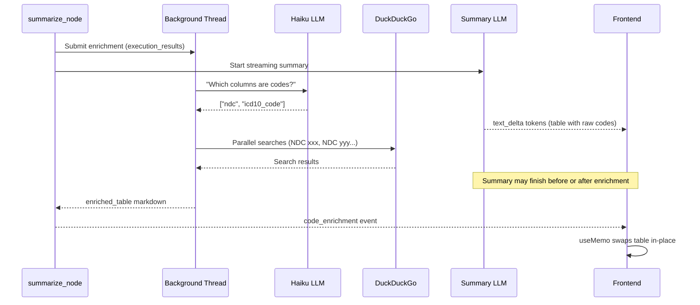

# Add Web Search Tool — Parallel Enrichment with LLM Detection

## Problem

The summarize agent hallucinates code descriptions (e.g., NDC drug codes). We need web search to get accurate descriptions, without adding latency to the summary.

## Design: Parallel From the Start, LLM-Detected Columns

`execution_results` (columns + data) are already in state when `summarize_node` begins. We launch the enrichment pipeline in a background thread **immediately**, running in parallel with the LLM summary streaming. The enrichment uses a cheap LLM (Haiku) to detect which columns contain coded identifiers, then web-searches for descriptions.




**Key insight:** Since enrichment runs in parallel with the summary LLM, the added latency is `max(0, enrichment_time - summary_time)`. If the summary takes longer than the enrichment (likely for complex queries), the user sees **zero additional delay**.

## Changes

### 1. Add dependency

In [pyproject.toml](agent_app/pyproject.toml), add `"duckduckgo-search>=7.0"` to `dependencies`.

### 2. Add `detect_code_lookup_endpoint` to LLMConfig and databricks.yml

**a) [config.py](agent_app/agent_server/multi_agent/core/config.py):**

- Add `detect_code_lookup_endpoint: str` field to `LLMConfig` dataclass
- In `from_env()`: `detect_code_lookup_endpoint=os.getenv("LLM_ENDPOINT_DETECT_CODE_LOOKUP", "databricks-claude-haiku-4-5")`
- In `from_model_config()`: `detect_code_lookup_endpoint=_mc_get(mc, "llm_endpoint_detect_code_lookup", "databricks-claude-haiku-4-5")`
- Note: defaults to Haiku (not to `d`) since this should always be a cheap/fast model regardless of the main LLM

**b) [databricks.yml](agent_app/databricks.yml):**

Add alongside the other `LLM_ENDPOINT`_* env vars (~line 33):

```yaml
          - name: LLM_ENDPOINT_DETECT_CODE_LOOKUP
            value: "databricks-claude-haiku-4-5"
```

This keeps the code detection/lookup LLM independently configurable in deployment.

### 3. Create web search utility + LLM code detection

New file: `agent_app/agent_server/multi_agent/tools/web_search.py`

Three main functions:

**a) `web_search(query, max_results=3) -> str`**

- Calls `duckduckgo_search.DDGS().text(query, max_results=max_results)`
- Returns formatted string of title + snippet
- 5s timeout per call, graceful error handling

**b) `detect_code_columns(columns, sample_data, llm) -> list[dict]`**

- Sends a short prompt to Haiku: "Given these column names and 3 sample rows, identify which columns contain coded identifiers (e.g., NDC, ICD-10, CPT, NAICS, ticker symbols, FIPS, etc.) that would benefit from a human-readable description. Return JSON: `[{\"column\": \"col_name\", \"code_type\": \"NDC\"}]`. If none, return `[]`."
- Uses `llm.invoke()` (single fast call, ~0.5s with Haiku)
- Returns list of `{column, code_type}` dicts

**c) `enrich_codes(columns, data, llm, writer=None) -> str | None`**

- Calls `detect_code_columns()` to identify code columns
- If none found, returns `None` immediately
- Extracts unique code values (up to 20)
- Searches DuckDuckGo in parallel using `concurrent.futures.ThreadPoolExecutor(max_workers=5)`: query format = `"{code_type} {value} description"` (e.g., "NDC 00054327099 drug name")
- Builds enriched markdown table: adds a "Description" column next to each code column
- 15s total timeout for the entire enrichment
- If `writer` is provided, emits progress events: "Detected coded columns: ndc", "Looking up 10 code descriptions..."
- Returns enriched table markdown string or `None`

### 4. Launch enrichment at top of `summarize_node`

In [summarize.py](agent_app/agent_server/multi_agent/agents/summarize.py) `summarize_node()`:

```python
import concurrent.futures

# --- 0. Kick off code enrichment in background (parallel with summary) ---
execution_results = state.get("execution_results", [])
exec_result = state.get("execution_result")
if not execution_results and exec_result:
    execution_results = [exec_result]

enrichment_future = None
first_result = next(
    (r for r in execution_results if r and r.get("success") and r.get("columns")),
    None,
)
if first_result:
    from ..tools.web_search import enrich_codes
    from databricks_langchain import ChatDatabricks
    config = get_config()
    enrich_llm = ChatDatabricks(
        endpoint=config.llm.detect_code_lookup_endpoint, temperature=0, max_tokens=500
    )
    pool = concurrent.futures.ThreadPoolExecutor(max_workers=1)
    enrichment_future = pool.submit(
        enrich_codes,
        first_result["columns"],
        first_result["result"],
        enrich_llm,
        writer,
    )

# --- 1. LLM text summary (streams to user via writer deltas) ---
summary = summarize_agent.generate_summary(context, writer=writer)

# --- 2. Chart generation ---
# ... existing code ...

# --- 3. SQL download ---
# ... existing code ...

# --- 4. Collect enrichment result (likely already done by now) ---
if enrichment_future:
    try:
        enriched_table = enrichment_future.result(timeout=20)
        if enriched_table:
            writer({"type": "code_enrichment", "enriched_table": enriched_table})
    except Exception as e:
        print(f"Code enrichment skipped: {e}")
    finally:
        pool.shutdown(wait=False)
```

The enrichment runs in a separate thread while the summary LLM streams tokens. By the time we reach step 4, the enrichment is likely already finished.

### 5. Handle `code_enrichment` event in stream handler

In [agent.py](agent_app/agent_server/agent.py), in the `custom` event handler (~line 416), add before the else fallback:

```python
elif et == "code_enrichment":
    enriched_table = event_data.get("enriched_table", "")
    if enriched_table:
        yield ResponsesAgentStreamEvent(
            type="response.output_item.done",
            item=_create_text_output_item(
                text=f"<!--ENRICHED_TABLE\n{enriched_table}\nENRICHED_TABLE-->",
                id=str(uuid4()),
            ),
        )
```

This sends the enriched table as a hidden output item wrapped in HTML comment markers.

### 6. Frontend: swap original table with enriched table

In [response.tsx](agent_app/e2e-chatbot-app-next/client/src/components/elements/response.tsx), in the existing `useMemo`, add after the `<details>` collapse logic:

```typescript
const enrichedMatch = text.match(
  /<!--ENRICHED_TABLE\n([\s\S]*?)\nENRICHED_TABLE-->/
);
if (enrichedMatch) {
  const enrichedTable = enrichedMatch[1];
  text = text.replace(/<!--ENRICHED_TABLE\n[\s\S]*?\nENRICHED_TABLE-->/, '');
  // Replace the first markdown table with the enriched version
  const tableRegex = /(\|[^\n]*\|\n\|[-| :]+\|\n(?:\|[^\n]*\|\n)*)/;
  text = text.replace(tableRegex, enrichedTable + '\n');
}
```

The regex finds the first markdown table (header row, separator row, data rows) and replaces it entirely with the enriched version. If no match (malformed table), the original stays as-is.

## Timing Analysis

- Summary LLM streaming: ~5-15s (depending on query complexity)
- Enrichment pipeline: Haiku detection ~~0.5s + parallel web searches ~3-5s = **~~4-6s total**
- Since they run in parallel: **effective added latency = 0s** for most queries
- Only if the summary is very fast (< 4s) would the user wait briefly for enrichment

## Graceful Degradation

- If Haiku says no code columns: no enrichment, no delay
- If web search fails for some codes: those get "---" in the Description column
- If entire enrichment times out (20s): skipped silently, original table stays
- If frontend regex doesn't match a table: enrichment marker is removed, original stays

