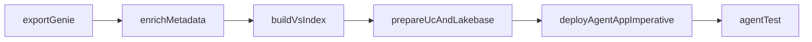

# Consolidate `agent_app` Bundle

## Goal

Turn [agent_app/databricks.yml](/Users/yang.yang/CursorProjects/KUMC_POC_hlsfieldtemp/agent_app/databricks.yml) into the only source of truth that remains under active maintenance, fold in the root ETL pipeline shape from [databricks.yml](/Users/yang.yang/CursorProjects/KUMC_POC_hlsfieldtemp/databricks.yml) and [resources/etl_pipeline.yml](/Users/yang.yang/CursorProjects/KUMC_POC_hlsfieldtemp/resources/etl_pipeline.yml), and rework `agent_app` so bundle resources are limited to jobs while actual resource creation, app deploy, and grants happen through notebooks/scripts run by those jobs.

## Planned Changes

### 1. Normalize bundle variables around the ETL flow

- Update [agent_app/databricks.yml](/Users/yang.yang/CursorProjects/KUMC_POC_hlsfieldtemp/agent_app/databricks.yml) to carry the root bundle's ETL-oriented variables and target overrides, especially `catalog_name`, `schema_name`, `sql_warehouse_id`, `pipeline_type`, and the ETL/vector-search settings.
- Either rename or bridge the current app-facing names (`catalog`, `schema`, `warehouse_id`) so the job notebooks, Lakebase helpers, and app deploy/test entrypoints all resolve from one variable model.
- After the merge, stop treating the root [databricks.yml](/Users/yang.yang/CursorProjects/KUMC_POC_hlsfieldtemp/databricks.yml) as a parallel config to maintain; it becomes legacy/reference-only or is retired.
- Propagate that variable alignment into:
  - [agent_app/scripts/deploy.sh](/Users/yang.yang/CursorProjects/KUMC_POC_hlsfieldtemp/agent_app/scripts/deploy.sh)
  - [agent_app/scripts/notebook_deploy_lib.py](/Users/yang.yang/CursorProjects/KUMC_POC_hlsfieldtemp/agent_app/scripts/notebook_deploy_lib.py)
  - the new notebook/script entrypoints for resource creation, grant application, app deploy, and app validation

### 2. Bring ETL steps under the `agent_app` bundle

- Add a jobs resource file under `agent_app/resources/` for two workflows:
  - `agent_app_preps_job`: tasks 1-4 only
  - full app pipeline: tasks 1-6 in sequence
- Define all maintained bundle resources under `agent_app/resources/*.yml` as jobs only.
- Reuse the root ETL logic from:
  - [etl/01_export_genie_spaces.py](/Users/yang.yang/CursorProjects/KUMC_POC_hlsfieldtemp/etl/01_export_genie_spaces.py)
  - [etl/02_enrich_table_metadata.py](/Users/yang.yang/CursorProjects/KUMC_POC_hlsfieldtemp/etl/02_enrich_table_metadata.py)
  - [etl/03_build_vector_search_index.py](/Users/yang.yang/CursorProjects/KUMC_POC_hlsfieldtemp/etl/03_build_vector_search_index.py)
- Move or copy those entrypoints into a bundle-owned path inside `agent_app` rather than referencing parent-directory notebooks, so bundle sync/deploy packages them reliably.

### 3. Replace declarative `agent_app/resources/*` provisioning

- The current `agent_app` codebase still uses declarative bundle-managed resources in:
  - [agent_app/resources/app.yml](/Users/yang.yang/CursorProjects/KUMC_POC_hlsfieldtemp/agent_app/resources/app.yml)
  - [agent_app/resources/database.yml](/Users/yang.yang/CursorProjects/KUMC_POC_hlsfieldtemp/agent_app/resources/database.yml)
  - [agent_app/resources/schemas.yml](/Users/yang.yang/CursorProjects/KUMC_POC_hlsfieldtemp/agent_app/resources/schemas.yml)
- The current deploy path in [agent_app/scripts/deploy.sh](/Users/yang.yang/CursorProjects/KUMC_POC_hlsfieldtemp/agent_app/scripts/deploy.sh) also resolves app metadata from `bundle validate`, which reflects that declarative app resource model.
- Refactor the deployment model so those resource files are no longer the place where app/database/schema/permission state is defined. Instead:
  - keep `agent_app/resources/` focused on job definitions
  - create notebook/script tasks that create or update the Databricks App and other required resources imperatively
  - create notebook/script tasks that apply Unity Catalog and Lakebase grants imperatively

### 4. Add task 4 for UC functions + Lakebase prep + setup Experiment path

- Create a dedicated prep entrypoint in `agent_app` for task 4 that registers UC functions using [agent_app/agent_server/multi_agent/tools/uc_functions.py](/Users/yang.yang/CursorProjects/KUMC_POC_hlsfieldtemp/agent_app/agent_server/multi_agent/tools/uc_functions.py).
- In the same task, create or ensure the MLflow experiment exists with a volume-backed artifact location derived from [agent_app/databricks.yml](/Users/yang.yang/CursorProjects/KUMC_POC_hlsfieldtemp/agent_app/databricks.yml) variables using the pattern `dbfs:/Volumes/${catalog}/${schema}/${volume_name}/mlflow-traces`.
- Reuse the existing Lakebase grant/bootstrap code from [agent_app/scripts/grant_lakebase_permissions.py](/Users/yang.yang/CursorProjects/KUMC_POC_hlsfieldtemp/agent_app/scripts/grant_lakebase_permissions.py) where possible.
- Fold the schema/database/grant intent currently split across declarative bundle resources into imperative notebook/script setup tasks instead.
- Make task 4 the resource-prep stage that establishes the prerequisites needed before app deployment rather than relying on bundle-managed `database_instances`, `schemas`, or app resource permissions.
- Parse the `catalog`, `schema`, and `volume_name` values from the single source of truth in [agent_app/databricks.yml](/Users/yang.yang/CursorProjects/KUMC_POC_hlsfieldtemp/agent_app/databricks.yml) instead of hardcoding the experiment artifact path.

### 5. Make tasks 5-6 imperative Databricks App deploy/test steps

- Model tasks 5 and 6 as app-native notebook/script tasks rather than root Model Serving notebooks or declarative app resources:
  - task 5: deploy/update the Databricks App imperatively
  - task 6: run app validation/smoke tests and permission verification
- The validation step should check the app-facing outcomes that matter here: app exists, service principal resolved, Lakebase bootstrap status, and any minimal health/smoke verification we can run safely.
- During the grant-permission portion of the flow, add the app service principal grant needed to write to the UC volume used for MLflow traces, in addition to the existing schema/Lakebase-related permissions.
- Update [agent_app/scripts/deploy.sh](/Users/yang.yang/CursorProjects/KUMC_POC_hlsfieldtemp/agent_app/scripts/deploy.sh) and [agent_app/scripts/notebook_deploy_lib.py](/Users/yang.yang/CursorProjects/KUMC_POC_hlsfieldtemp/agent_app/scripts/notebook_deploy_lib.py) so they orchestrate the new job-centric flow instead of assuming a declarative app resource is present in the bundle.

## Expected Job Shape

## Notes

- The root `resources/*.yml` files are useful as orchestration patterns because they define jobs whose tasks call notebooks with parameters. The refined `agent_app` plan adopts that pattern, but not the current declarative app/database/schema provisioning style found in `agent_app/resources/`.
- I will keep the prep job separate from the full job so steps 1-4 can be run independently before an app deploy.
- The intended end state is one maintained bundle entrypoint: [agent_app/databricks.yml](/Users/yang.yang/CursorProjects/KUMC_POC_hlsfieldtemp/agent_app/databricks.yml). The root [databricks.yml](/Users/yang.yang/CursorProjects/KUMC_POC_hlsfieldtemp/databricks.yml) will no longer be treated as a second active source of truth.
- The intended end state is also one deployment style: jobs and notebooks/scripts create resources and apply permissions. `agent_app/resources/` should no longer be the place where non-job resources are declared and maintained.
- The experiment artifact root should follow the bundle-variable-derived UC volume path pattern `dbfs:/Volumes/${catalog}/${schema}/${volume_name}/mlflow-traces`, and the app service principal should receive write access to that volume as part of the imperative grants flow.
- I will work carefully around the existing local changes in [agent_app/scripts/grant_lakebase_permissions.py](/Users/yang.yang/CursorProjects/KUMC_POC_hlsfieldtemp/agent_app/scripts/grant_lakebase_permissions.py) and [agent_app/scripts/notebook_deploy_lib.py](/Users/yang.yang/CursorProjects/KUMC_POC_hlsfieldtemp/agent_app/scripts/notebook_deploy_lib.py) rather than overwriting them.

