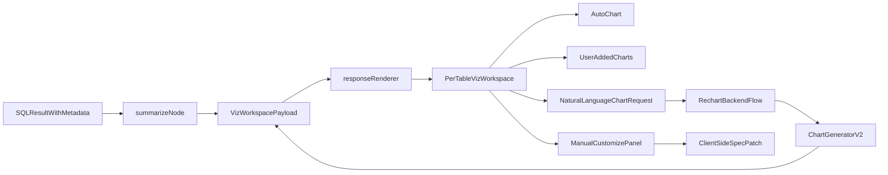

# Chart Practicality Overhaul

## Goals
- Improve automatic chart quality so charts are practical, readable, and aligned to the shape and purpose of each result table.
- Replace the current one-chart-per-result rendering with a per-table collapsible visualization workspace that can contain the table plus multiple related charts.
- Add two user-facing customization paths per table:
  - natural-language re-charting from the existing table/result context
  - manual controls for x/y/z/group/time/chart type/color and add-vs-replace behavior
- Use a hybrid execution model: fast client-side updates when existing shipped data/spec is enough, backend regeneration when NL intent resolution or safer aggregation is needed.
- Use a builder-style manual editor inspired by modern BI tools: right-side panel, field shelves, expandable setting groups, presets, and guardrails that prevent invalid or unreadable chart configurations.

## Current Integration Points
- Backend chart generation lives in [agent_app/agent_server/multi_agent/agents/chart_generator.py](/Users/yang.yang/CursorProjects/KUMC_POC_hlsfieldtemp/agent_app/agent_server/multi_agent/agents/chart_generator.py).
- Charts and tables are emitted independently from [agent_app/agent_server/multi_agent/agents/summarize.py](/Users/yang.yang/CursorProjects/KUMC_POC_hlsfieldtemp/agent_app/agent_server/multi_agent/agents/summarize.py).
- Frontend chart rendering and chart-type switching live in [agent_app/e2e-chatbot-app-next/client/src/components/elements/interactive-chart.tsx](/Users/yang.yang/CursorProjects/KUMC_POC_hlsfieldtemp/agent_app/e2e-chatbot-app-next/client/src/components/elements/interactive-chart.tsx) and [agent_app/e2e-chatbot-app-next/client/src/components/elements/chart-spec.ts](/Users/yang.yang/CursorProjects/KUMC_POC_hlsfieldtemp/agent_app/e2e-chatbot-app-next/client/src/components/elements/chart-spec.ts).
- Markdown fence parsing and embedded widget routing live in [agent_app/e2e-chatbot-app-next/client/src/components/elements/response.tsx](/Users/yang.yang/CursorProjects/KUMC_POC_hlsfieldtemp/agent_app/e2e-chatbot-app-next/client/src/components/elements/response.tsx).
- Existing collapsible/tabbed presentation patterns live in [agent_app/e2e-chatbot-app-next/client/src/components/elements/tab-widget.tsx](/Users/yang.yang/CursorProjects/KUMC_POC_hlsfieldtemp/agent_app/e2e-chatbot-app-next/client/src/components/elements/tab-widget.tsx) and [agent_app/e2e-chatbot-app-next/client/src/components/elements/paginated-table.tsx](/Users/yang.yang/CursorProjects/KUMC_POC_hlsfieldtemp/agent_app/e2e-chatbot-app-next/client/src/components/elements/paginated-table.tsx).

## Target Architecture

## Backend Plan
- Refactor [agent_app/agent_server/multi_agent/agents/chart_generator.py](/Users/yang.yang/CursorProjects/KUMC_POC_hlsfieldtemp/agent_app/agent_server/multi_agent/agents/chart_generator.py) into a more opinionated `ChartGeneratorV2` flow:
  - add semantic column profiling beyond `numeric/date/text` to detect IDs, labels, high-cardinality dimensions, percentages, currencies, likely measures, and low-value numeric fields
  - add deterministic chart scoring/guardrails that can override poor LLM picks
  - prefer safe defaults: line for time series, sorted bar for ranked comparisons, stacked/normalized only for composition, scatter only for real numeric-vs-numeric relationships, pie only for very small shares, and no-chart/table fallback when confidence is low
  - replace the current "first 30 rows" fallback with practical transforms such as top-N, time bucketing, ranking, percent-of-total, or frequency
  - preserve richer reasoning metadata in emitted payloads, such as chart rationale, confidence, source table id, usable fields, and whether the chart was auto-generated or user-requested
- Add a dedicated backend re-chart path that accepts:
  - source table/result identifier
  - shipped result rows or cached result reference
  - user NL request and/or structured manual overrides
  - add-vs-replace mode
- Update [agent_app/agent_server/multi_agent/agents/summarize.py](/Users/yang.yang/CursorProjects/KUMC_POC_hlsfieldtemp/agent_app/agent_server/multi_agent/agents/summarize.py) to emit one structured per-table visualization payload instead of separate sibling chart/table fences.
- Extend result metadata flow so per-table payloads carry stable ids and enough context for follow-up chart requests.

## Frontend Plan
- Introduce a new per-table visualization workspace component in the chat renderer, likely routed from a new fence/payload type in [agent_app/e2e-chatbot-app-next/client/src/components/elements/response.tsx](/Users/yang.yang/CursorProjects/KUMC_POC_hlsfieldtemp/agent_app/e2e-chatbot-app-next/client/src/components/elements/response.tsx).
- Build a collapsible workspace UI per result table that contains:
  - table title/result label
  - primary auto-generated chart
  - additional user-added charts for the same table
  - underlying paginated table
  - optional SQL/explanation details reuse from existing patterns
- Upgrade [agent_app/e2e-chatbot-app-next/client/src/components/elements/interactive-chart.tsx](/Users/yang.yang/CursorProjects/KUMC_POC_hlsfieldtemp/agent_app/e2e-chatbot-app-next/client/src/components/elements/interactive-chart.tsx) from a simple chart-type switcher into a chart card with:
  - add/replace actions
  - NL prompt trigger button
  - open-customizer button
  - better metadata display such as rationale/aggregation/confidence/source row limits
- Extend [agent_app/e2e-chatbot-app-next/client/src/components/elements/chart-spec.ts](/Users/yang.yang/CursorProjects/KUMC_POC_hlsfieldtemp/agent_app/e2e-chatbot-app-next/client/src/components/elements/chart-spec.ts) so the spec supports:
  - chart ids and source table ids
  - display presets/colors
  - allowed field choices for manual editing
  - richer config for grouped/manual/custom charts
- Add a side customization panel for manual editing against the current table/chart context, following a modern visualization-builder interaction model:
  - a right-side drawer/panel opened from each chart card
  - top-level widget controls for chart title, subtitle/description, and add-vs-replace mode
  - a visualization selector with recommended chart presets and chart-specific guidance
  - field shelves for x, y, z/size, color, facet, tooltip, labels, annotations, and optional secondary axis
  - transform controls for time bucket, aggregation function, sorting, top-N, percent-of-total, histogram bins, ranking comparison, and stacking/normalization
  - style controls for palette, single-series color, legend, axis label rotation, label density, gridlines, reference lines, and number formatting
  - interaction controls for reset, duplicate chart, remove chart, save preset, and revert to auto-generated chart
  - inline validation/guardrails that disable impossible combinations and explain why
- Keep a fast client-side path for edits that only require spec mutation against already shipped rows, and a backend round-trip for NL requests or changes that need new aggregation.

## Manual Builder Principles
- Start from a simple default view, then progressively disclose advanced settings.
- Separate field mapping from styling so analytical choices are not buried under cosmetics.
- Surface recommended defaults first, but still allow expert overrides.
- Apply chart-specific controls dynamically so the panel stays relevant to the selected visualization.
- Validate choices against the current table schema, cardinality, and row limits before applying them.
- Prefer terminology users expect from modern analytics tools: X axis, Y axis, Breakdown, Color, Facet, Tooltip, Annotation, Sort, Aggregation, and Time grain.
- Keep immediate visual feedback: changing a control should update a preview or the live chart with debounced application.
- Distinguish cosmetic edits from data-shaping edits so the UI knows when it can stay client-side vs when it must call the backend.

## UX And Product Rules
- Default to readability over variety.
- Show why a chart was chosen and when data was transformed.
- Prevent unreadable charts by disabling impossible or low-value combinations in the manual panel.
- Keep charts scoped to the existing shipped/cached result window and clearly label when only preview-limited data is being visualized.
- Support multiple charts per table without clutter by collapsing the workspace by default and keeping actions on the chart card.
- Use modern builder conventions in the customization panel:
  - field shelves near the top
  - advanced sections collapsed by default
  - chart recommendations and warnings inline
  - obvious reset/revert affordances
  - consistent terminology between auto-chart explanations, manual controls, and NL requests

## Testing And Validation
- Add/expand backend tests around chart selection, semantic field classification, row-grain safety, and NL/manual re-chart requests.
- Add frontend tests for the new visualization workspace, chart payload parsing, add-vs-replace behavior, and manual customization state.
- Add at least one end-to-end chat test covering: auto chart + per-table workspace + NL re-chart + manual add/replace.
- Verify schema compatibility carefully because parse failures in [agent_app/e2e-chatbot-app-next/client/src/components/elements/chart-spec.ts](/Users/yang.yang/CursorProjects/KUMC_POC_hlsfieldtemp/agent_app/e2e-chatbot-app-next/client/src/components/elements/chart-spec.ts) currently fall back to raw code rendering.

## Execution Order
1. Stabilize the new chart payload contract and per-table visualization payload shape.
2. Rework backend chart intelligence and re-chart endpoint/flow.
3. Add the new frontend workspace and route payloads into it.
4. Add NL re-chart and builder-style manual customization UX.
5. Tighten tests and do polish/readability passes.