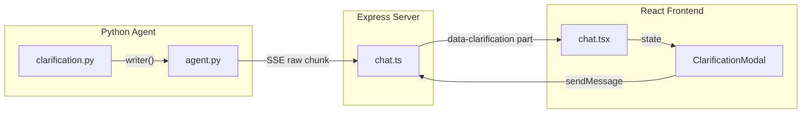

# Clarification Interrupt Popup Modal

## Current Behavior

When clarification is needed, the Python agent emits `clarification_content` as a custom streaming event, which `agent.py` formats into **plain markdown text** and streams to the frontend as regular assistant content. The graph then calls `interrupt()`, ending the stream. The user must type a response in the normal chat input to resume.

## Architecture

The data must flow through 4 layers:




## Changes by Layer

### 1. Python: Emit structured clarification data alongside text

`**[agent_app/agent_server/multi_agent/agents/clarification.py](agent_app/agent_server/multi_agent/agents/clarification.py)**` (lines 469-476)

Enhance the `writer()` call in `_clarify` to include structured `reason` and `options` fields alongside `content`:

```python
writer({
    "type": "clarification_content",
    "content": markdown.strip(),
    "reason": clarification_reason,
    "options": clarification_options,
})
```

`**[agent_app/agent_server/agent.py](agent_app/agent_server/agent.py)**` (lines 503-514)

In the `clarification_content` handler, emit an **additional** `ResponsesAgentStreamEvent` carrying the structured data in `databricks_output`. `ResponsesAgentStreamEvent` uses `ConfigDict(extra="allow")` so arbitrary fields pass through:

```python
elif et in ("meta_answer_content", "clarification_content", "clarification_requested"):
    # ... existing text event emission stays ...
    # NEW: emit structured clarification data as a separate event
    if et == "clarification_content" and isinstance(event_data, dict):
        yield ResponsesAgentStreamEvent(
            type="response.output_item.done",
            item=_create_text_output_item(text="", id=str(uuid4())),
            databricks_output={
                "clarification": {
                    "reason": event_data.get("reason", ""),
                    "options": event_data.get("options", []),
                }
            },
        )
```

`**[agent_app/agent_server/multi_agent/core/responses_agent.py](agent_app/agent_server/multi_agent/core/responses_agent.py)**` -- apply the same pattern in its `clarification_content` handler (around line 630+).

### 2. Express Server: Capture clarification from raw chunks, emit as data part

`**[agent_app/e2e-chatbot-app-next/server/src/routes/chat.ts](agent_app/e2e-chatbot-app-next/server/src/routes/chat.ts)**` (lines 270-367)

- Add a `clarificationData` capture variable alongside existing `traceId` (line ~271):

```typescript
  let clarificationData: { reason: string; options: string[] } | null = null;
  

```

- In `onChunk`, detect `raw.databricks_output.clarification` (same pattern as trace extraction, ~line 298-312):

```typescript
  if (raw?.databricks_output?.clarification) {
      clarificationData = raw.databricks_output.clarification;
  }
  

```

- After `drainStreamToWriter` completes, write the data part (line ~367, before `data-traceId`):

```typescript
  if (clarificationData) {
      writer.write({ type: 'data-clarification', data: clarificationData });
  }
  writer.write({ type: 'data-traceId', data: traceId });
  

```

### 3. Shared Types: Add clarification to `CustomUIDataTypes`

`**[agent_app/e2e-chatbot-app-next/packages/core/src/types.ts](agent_app/e2e-chatbot-app-next/packages/core/src/types.ts)**` (line 10-14)

```typescript
export type CustomUIDataTypes = {
  error: string;
  usage: LanguageModelUsage;
  traceId: string | null;
  clarification: { reason: string; options: string[] } | null;
};
```

### 4. React Frontend: Modal component + state wiring

**New file: `[agent_app/e2e-chatbot-app-next/client/src/components/clarification-modal.tsx](agent_app/e2e-chatbot-app-next/client/src/components/clarification-modal.tsx)`**

A Radix Dialog-based modal (reuse the existing `alert-dialog.tsx` primitives at `[client/src/components/ui/alert-dialog.tsx](agent_app/e2e-chatbot-app-next/client/src/components/ui/alert-dialog.tsx)`) containing:

- **Header**: "Clarification Needed"
- **Body**: The `reason` text, radio-button list of `options` (if any), and a "Custom response" text input for freeform answers
- **Footer**: Cancel button (closes modal, user returns to chat) and Confirm button (sends the selected option text or custom input as a new user message via `sendMessage`)

UX details:

- Selecting a radio option pre-fills the confirm value; the custom input clears the radio selection and vice versa
- Cancel = `onOpenChange(false)`, no message sent -- user can type freely in chat or start a new topic
- Confirm calls `sendMessage({ role: 'user', parts: [{ type: 'text', text: selectedValue }] })` then closes the modal. Because the thread has a pending interrupt, the backend treats this as `Command(resume=...)`.

`**[agent_app/e2e-chatbot-app-next/client/src/components/chat.tsx](agent_app/e2e-chatbot-app-next/client/src/components/chat.tsx)`** (lines 183-190, 361-408)

- Add state: `const [clarification, setClarification] = useState<{reason: string; options: string[]} | null>(null);`
- In `onData`, detect `data-clarification`:

```typescript
  if (dataPart.type === 'data-clarification' && dataPart.data) {
      setClarification(dataPart.data as { reason: string; options: string[] });
  }
  

```

- In the JSX, render `<ClarificationModal>` passing `clarification`, `onClose={() => setClarification(null)}`, and `sendMessage`
- After `sendMessage` from the modal, call `setClarification(null)` to dismiss

## Key Design Decisions

- **Text still streams inline**: The clarification markdown continues to appear in the chat thread as regular text (preserves history). The modal is an **overlay** on top of that, providing structured interaction.
- **Cancel = dismiss only**: Canceling the modal doesn't send any message. The interrupt remains pending. The user's next chat message (typed manually) will still trigger a resume on the same thread. `_confirm_continuation` handles whether it's an answer or a new question.
- **No WebSocket needed**: The existing SSE + `data-` part mechanism is sufficient. The structured data rides alongside the text stream.
- `**ResponsesAgentStreamEvent(extra="allow")`**: The Pydantic model accepts arbitrary extra fields, so `databricks_output` passes through the SSE serialization to the Express server's raw chunk handler.

