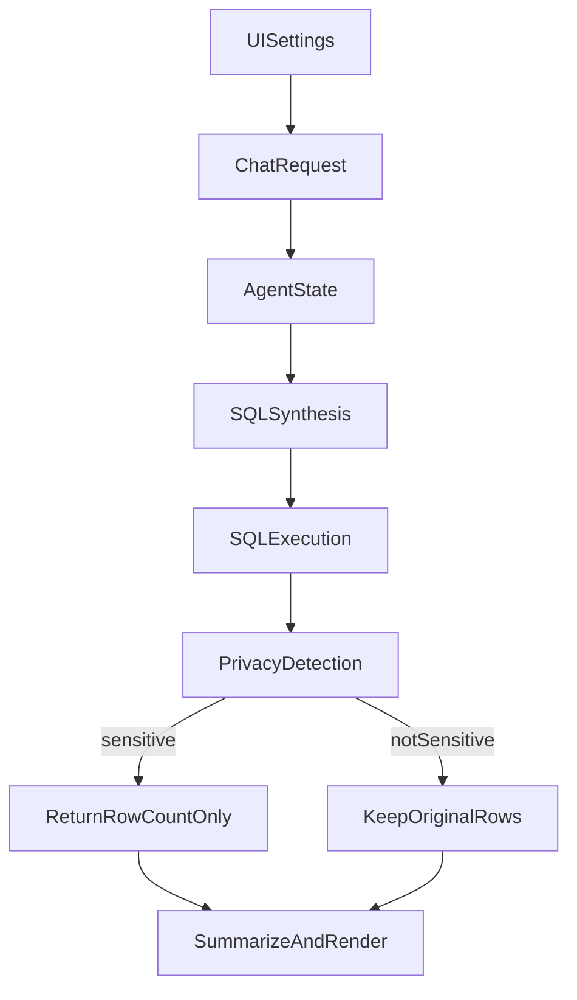

# Conditional Privacy Count Plan

## Goal

Make `countOnly` conditional instead of hard-coded: only convert a result to count-only when the query/result looks patient- or identifier-level. Otherwise keep the original result flow.

## Proposed Approach

Use a two-stage privacy decision in the active app path:

### Stage 1: Carry an intent flag, not a hard rewrite

Keep the UI/server plumbing for `countOnly`, but treat it as a privacy preference rather than immediately wrapping every SQL query in `COUNT(*)`.

Target files:

- [agent_app/e2e-chatbot-app-next/client/src/components/agent-settings.tsx](agent_app/e2e-chatbot-app-next/client/src/components/agent-settings.tsx)
- [agent_app/e2e-chatbot-app-next/server/src/routes/chat.ts](agent_app/e2e-chatbot-app-next/server/src/routes/chat.ts)
- [agent_app/agent_server/agent.py](agent_app/agent_server/agent.py)
- [agent_app/agent_server/multi_agent/core/state.py](agent_app/agent_server/multi_agent/core/state.py)

Key change:

- Preserve `count_only` in state, but stop using it as an unconditional SQL wrapper.

### Stage 2: Detect sensitive/patient-level output after synthesis/execution

Add a privacy detector that combines:

- SQL heuristics: selected column names/aliases, obvious identifier fields, non-aggregated detail selects
- Result metadata: returned `columns`, existing `row_grain_hint`, and execution result shape

Likely primary hook points:

- [agent_app/agent_server/multi_agent/agents/sql_execution.py](agent_app/agent_server/multi_agent/agents/sql_execution.py)
- [agent_app/agent_server/multi_agent/agents/sql_execution_agent.py](agent_app/agent_server/multi_agent/agents/sql_execution_agent.py)

Detection examples to flag as sensitive:

- patient/member/person identifiers (`patient_id`, `member_id`, `mrn`, etc.)
- direct PII-like fields (`name`, `dob`, `ssn`, etc.)
- row-grain hints indicating detail rows rather than aggregate rows

### Stage 3: Replace sensitive results with safe count output

When privacy protection triggers:

- replace detailed `result` payload with a compact count result
- prefer `COUNT(DISTINCT patient_id)` (or equivalent detected patient/member identifier) when one can be identified safely
- fall back to plain row count when no reliable patient identifier can be found
- attach an explicit flag/reason so summarization and UI rendering know the result was privacy-collapsed

Likely state/result extensions:

- add fields like `privacy_collapsed`, `privacy_reason`, `original_result_row_count`, `privacy_count_basis`

Target file:

- [agent_app/agent_server/multi_agent/core/state.py](agent_app/agent_server/multi_agent/core/state.py)

### Stage 4: Make summarize/render respect privacy-collapsed results

Prevent later stages from re-exposing details through previews, charts, downloads, or code-enrichment when a result has been privacy-collapsed.

Target files:

- [agent_app/agent_server/multi_agent/agents/summarize_agent.py](agent_app/agent_server/multi_agent/agents/summarize_agent.py)
- [agent_app/agent_server/multi_agent/agents/summarize.py](agent_app/agent_server/multi_agent/agents/summarize.py)

Expected behavior:

- for privacy-collapsed results, summarize the count and rationale only
- skip detailed preview tables / downloadable tables / chart generation for that query result

## Why This Hook Point

Current blanket wrapping happens too early in:

- [agent_app/agent_server/multi_agent/agents/sql_synthesis.py](agent_app/agent_server/multi_agent/agents/sql_synthesis.py)

That is too coarse because it cannot distinguish:

- safe aggregate queries that should stay as-is
- detail queries that would expose patient-level information

Execution-time detection is safer because it has access to the actual returned `columns`, `row_grain_hint`, and final result shape.

## Validation

Verify with three cases:

- Aggregate-safe query: grouped counts with no identifier/PII columns should remain unchanged.
- Patient-detail query: rows containing `patient_id`-like fields should collapse to a distinct-patient count.
- Mixed/ambiguous query: identifier-like aliases or detail-grain outputs should collapse safely, falling back to row count if no reliable patient identifier is available.

## Important Note

There is an older duplicate implementation under `src/multi_agent/...`, but the active runtime path is under `agent_app/agent_server/...`. Prioritize the `agent_app` path unless you specifically want both trees kept in sync.