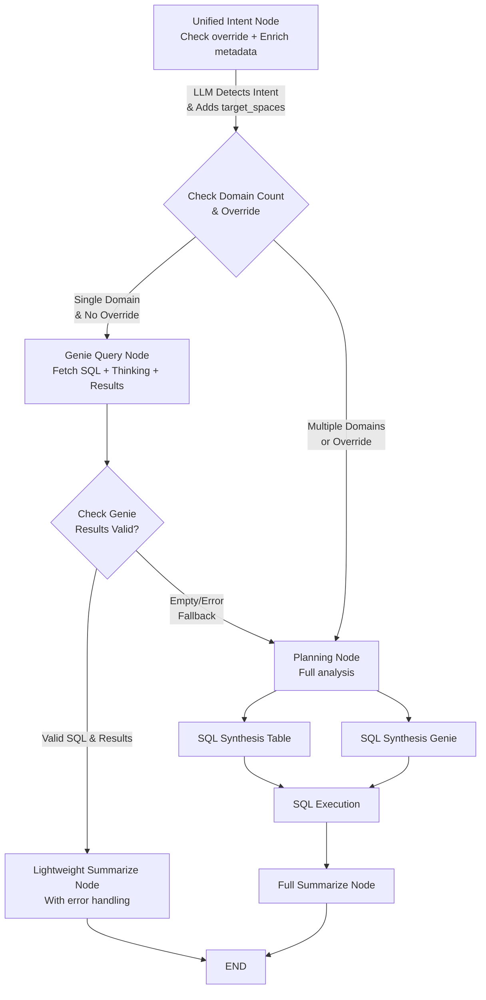

# Smart Routing for Single-Domain Queries

## Overview

Optimize workflow performance by adding smart routing logic for single-domain queries (regardless of complexity). These queries get enriched metadata with `target_spaces` field and route directly to GenieAgent, bypassing the planning node entirely. This reduces latency by 1.5-3 seconds for single-domain questions.

## Architecture Changes

### Current Flow

```
unified_intent_node → planning_node → sql_synthesis → sql_execution → summarize
```

### New Flow




## Key Features

### 1. User Override for Full Analysis (LLM-Detected, NOT Regex)

The **LLM intelligently detects** when users want comprehensive analysis, rather than using rigid keyword matching.

**Why LLM-based detection?**

- Understands natural language intent vs just matching keywords
- Handles variations: "be thorough", "I need full details", "analyze comprehensively"  
- Avoids false positives: "full table" vs "full analysis"
- More robust and user-friendly

**Example**: 

```
User: "How many patients in total we have? Do full analysis"
LLM: Detects override intent → sets use_full_analysis: true in metadata
System: Skips quick route → uses planning agent (even though single-domain)
```

### 2. Automatic Fallback to Planning

If Genie returns empty SQL or results, automatically fallback to planning agent:

- Empty SQL query from Genie → route to planning
- Empty results from Genie → route to planning
- Genie agent error/exception → route to planning

This ensures robustness when quick route encounters issues.

### 3. Graceful Error Handling in Summarization

Lightweight summarization node handles errors gracefully:

- Missing SQL/results → friendly error message with explanation
- Result formatting errors → show raw data with error note
- No thinking/analysis → display "*No analysis provided*"

## Implementation Details

### 1. Metadata Enrichment in Unified Intent Node

**Purpose**: For single-domain queries, enrich metadata with `target_spaces` field containing space mapping

**Location**: 

- Notebook: `[Notebooks/archive/Super_Agent_hybrid_original.py](Notebooks/archive/Super_Agent_hybrid_original.py)` - in `unified_intent_context_clarification_node` (around line 3432)
- Modular: `[src/multi_agent/agents/clarification.py](src/multi_agent/agents/clarification.py)` - in `unified_intent_context_clarification_node`

**Logic**: After LLM returns metadata with domain, check if single domain and add target_spaces

**Code Addition** (at end of unified_intent_context_clarification_node, before return):

```python
# NEW: Enrich metadata with target_spaces for single-domain queries
# (only if LLM did not detect override intent)
metadata = result.get("metadata", {})
domain = metadata.get("domain")
use_full_analysis = metadata.get("use_full_analysis", False)  # LLM-detected flag

if use_full_analysis:
    print(f"⚠ LLM detected user request for full analysis - skipping quick route")
    # Don't add target_spaces, will route to planning
else:
    # Check if single domain (not multiple domains separated by comma)
    if domain and isinstance(domain, str) and "," not in domain:
        # Look up space_id and space_name for this domain
        try:
            space_info = lookup_space_for_domain(domain, TABLE_NAME)
            if space_info:
                # Add target_spaces to metadata
                metadata["target_spaces"] = {
                    space_info["space_id"]: space_info["space_name"]
                }
                print(f"✓ Enriched metadata with target_spaces: {space_info['space_name']}")
        except Exception as e:
            print(f"⚠ Could not enrich metadata with target_spaces: {e}")

# Update metadata in result
result["metadata"] = metadata
```

### 2. New Node: `single_domain_genie_node`

**Purpose**: Handle single-domain queries (any complexity) by calling one Genie space directly and extracting SQL, thinking, and results

**Location**: 

- Notebook: `[Notebooks/archive/Super_Agent_hybrid_original.py](Notebooks/archive/Super_Agent_hybrid_original.py)` (after line 4043)
- Modular: New file `[src/multi_agent/agents/single_domain.py](src/multi_agent/agents/single_domain.py)`

**Logic**:

1. Extract `target_spaces` from `state["current_turn"]["metadata"]` (added by unified intent node)
2. Get the `space_id` and `space_name` from target_spaces
3. Create or get cached Genie agent for that single space using `get_or_create_genie_agent()`
4. Invoke Genie agent with the user's query from `current_turn["query"]`
5. **Extract three key components from Genie response**:
  - SQL query (from the generated SQL)
  - Thinking/reasoning (from Genie's explanation)
  - Results (the actual query execution results from Genie)
6. Package everything and handoff to `lightweight_summarize_single_domain` node

**Key Code Pattern**:

```python
def single_domain_genie_node(state: AgentState) -> dict:
    from langgraph.config import get_stream_writer
    writer = get_stream_writer()
    
    current_turn = state.get("current_turn", {})
    metadata = current_turn.get("metadata", {})
    target_spaces = metadata.get("target_spaces", {})
    
    if not target_spaces:
        raise ValueError("No target_spaces in metadata for single-domain query")
    
    # Extract space_id and space_name from target_spaces
    space_id = list(target_spaces.keys())[0]
    space_name = target_spaces[space_id]
    
    writer({"type": "agent_start", "agent": "single_domain_genie", "content": f"Routing to {space_name} Genie space"})
    
    # Get cached Genie agent
    genie_agent = get_or_create_genie_agent(space_id, space_name, f"Agent for {space_name}")
    
    # Query the Genie space - Genie returns SQL, reasoning, and results
    print(f"🤖 Calling Genie space: {space_id} ({space_name})")
    
    try:
        genie_response = genie_agent.invoke(current_turn["query"])
        
        # Extract components from Genie response
        sql_query = genie_response.get("sql", "")
        thinking = genie_response.get("description", "")  # Genie's reasoning
        results = genie_response.get("result", [])  # Actual query results
        
        # NEW: Fallback check - if Genie returns empty SQL or results, route to planning
        if not sql_query or not results:
            print(f"⚠ Genie returned empty SQL or results - falling back to planning agent")
            writer({
                "type": "agent_fallback", 
                "agent": "single_domain_genie", 
                "content": f"Genie couldn't generate valid results, routing to planning for full analysis"
            })
            
            return {
                "genie_fallback": True,
                "genie_fallback_reason": "Empty SQL or results from Genie",
                "next_agent": "planning"
            }
        
        print(f"✓ Genie returned SQL ({len(sql_query)} chars), thinking, and {len(results)} result rows")
        
        writer({"type": "agent_result", "agent": "single_domain_genie", "content": f"Retrieved {len(results)} rows from Genie"})
        
        # Package for lightweight summarization
        return {
            "genie_sql": sql_query,
            "genie_thinking": thinking,
            "genie_results": results,
            "genie_space_id": space_id,
            "genie_space_name": space_name,
            "next_agent": "lightweight_summarize_single_domain"
        }
        
    except Exception as e:
        # NEW: Error handling - route to planning on Genie failure
        print(f"❌ Genie agent error: {e}")
        writer({
            "type": "agent_error", 
            "agent": "single_domain_genie", 
            "content": f"Genie agent failed: {str(e)}, routing to planning"
        })
        
        return {
            "genie_fallback": True,
            "genie_fallback_reason": f"Genie error: {str(e)}",
            "next_agent": "planning"
        }
```

**Note**: Genie agents already execute the SQL and return results, so we skip the sql_execution node entirely.

**Genie Response Structure**:
When you invoke a GenieAgent from `databricks_langchain`, it returns a structured response:

```python
{
    "sql": "SELECT taxonomy_code, COUNT(*) as frequency...",  # The generated SQL
    "description": "This query finds the top 5 most frequent...",  # Reasoning/thinking
    "result": [  # Actual query results (already executed)
        {"taxonomy_code": "207Q00000X", "frequency": 150},
        {"taxonomy_code": "363L00000X", "frequency": 120},
        ...
    ],
    "metadata": {
        "space_id": "...",
        "execution_time_ms": 1234
    }
}
```

This is why we can extract all three components (SQL, thinking, results) in one call and skip sql_execution entirely.

### 3. New Node: `lightweight_summarize_single_domain_node`

**Purpose**: Lightweight summarization specifically for single-domain queries that already have results from Genie

**Location**: Same files as simple_query_genie_node

**Why separate from main summarize node?**:

- Main summarize node expects: `execution_result`, `sql_query`, `sql_synthesis_explanation`, etc.
- Simple queries have: `genie_sql`, `genie_thinking`, `genie_results` (different structure)
- Lightweight summarization is much faster (no need to format execution context, planning details, etc.)

**Logic**:

1. Extract Genie components from state: `genie_sql`, `genie_thinking`, `genie_results`
2. Format results as a readable table (markdown or pandas DataFrame display)
3. Generate concise summary combining:
  - User's original query
  - Genie's thinking/reasoning
  - The SQL that was executed
  - The results in a readable format
4. Return final summary and end workflow

**Key Code Pattern**:

```python
def lightweight_summarize_single_domain_node(state: AgentState) -> dict:
    from langgraph.config import get_stream_writer
    import pandas as pd
    
    writer = get_stream_writer()
    writer({"type": "summary_start", "content": "Generating summary for single-domain query..."})
    
    # Extract Genie components
    genie_sql = state.get("genie_sql", "")
    genie_thinking = state.get("genie_thinking", "")
    genie_results = state.get("genie_results", [])
    space_name = state.get("genie_space_name", "")
    
    current_turn = state.get("current_turn", {})
    original_query = current_turn.get("query", "")
    
    # Format results as DataFrame for display
    results_display = ""
    if genie_results:
        try:
            df = pd.DataFrame(genie_results)
            display_rows = min(100, len(df))
            results_display = df.head(display_rows).to_markdown(index=False)
            if len(df) > display_rows:
                results_display += f"\n\n*Showing {display_rows} of {len(df)} total rows*"
        except Exception as e:
            results_display = f"Error formatting results: {e}\n{genie_results[:3]}"
    
    # Generate concise summary
    summary = f"""## Query Results

**Your Question**: {original_query}

**Analysis**: {genie_thinking}

**SQL Query**:
```sql
{genie_sql}
```

**Results** ({len(genie_results)} rows):

{results_display}

---

*Query executed via {space_name} Genie space*
"""

```
print(f"✓ Lightweight summary generated ({len(summary)} chars)")
writer({"type": "summary_complete", "content": "Summary complete"})

return {
    "final_summary": summary,
    "messages": [AIMessage(content=summary)]
}
```

```

### 4. Modified Routing Logic: `route_after_unified`

**Location**: 

- Notebook: `[Notebooks/archive/Super_Agent_hybrid_original.py](Notebooks/archive/Super_Agent_hybrid_original.py)` line 4758
- Modular: `[src/multi_agent/core/graph.py](src/multi_agent/core/graph.py)` line 47

**Current Logic**:

```python
def route_after_unified(state: AgentState) -> str:
    if state.get("is_irrelevant", False):
        return END
    if state.get("is_meta_question", False):
        return END
    if state.get("question_clear", False):
        return "planning"
    return END
```

**New Logic** (Simplified):

```python
def route_after_unified(state: AgentState) -> str:
    # Existing checks
    if state.get("is_irrelevant", False):
        return END
    if state.get("is_meta_question", False):
        return END
    if not state.get("question_clear", False):
        return END  # Clarification needed
    
    # NEW: Check if single domain (any complexity)
    current_turn = state.get("current_turn", {})
    metadata = current_turn.get("metadata", {})
    target_spaces = metadata.get("target_spaces")
    
    # If target_spaces exists, it's a single-domain query → route to Genie
    if target_spaces:
        return "single_domain_genie"
    
    # Default: full planning for multi-domain or unknown queries
    return "planning"
```

### 5. Helper Function: `lookup_space_for_domain`

**Purpose**: Map domain to corresponding space_id and space_name

**Location**: Near other helper functions (around line 957 in notebook)

**Logic**:

```python
def lookup_space_for_domain(domain: str, table_name: str = TABLE_NAME) -> dict:
    """
    Look up the Genie space_id and space_name for a given domain.
    
    Args:
        domain: Domain name from metadata (e.g., "providers", "claims")
        table_name: Metadata table name
    
    Returns:
        Dict with space_id and space_name, or None if not found
    """
    from pyspark.sql import SparkSession
    spark = SparkSession.builder.getOrCreate()
    
    # Query metadata table for space matching this domain
    # Match on space summary or searchable content
    df = spark.sql(f"""
        SELECT DISTINCT space_id, space_title as space_name
        FROM {table_name}
        WHERE chunk_type = 'space_summary'
        AND (
            LOWER(searchable_content) LIKE '%{domain.lower()}%'
            OR LOWER(space_title) LIKE '%{domain.lower()}%'
        )
        LIMIT 1
    """)
    
    result = df.collect()
    if result:
        return {
            "space_id": result[0]["space_id"],
            "space_name": result[0]["space_name"]
        }
    else:
        print(f"⚠ No Genie space found for domain: {domain}")
        return None
```

### 6. Graph Updates

**Location**: `create_super_agent_hybrid()` function

**Changes**:

```python
# Add new nodes
workflow.add_node("single_domain_genie", single_domain_genie_node)
workflow.add_node("lightweight_summarize_single_domain", lightweight_summarize_single_domain_node)

# Update routing from unified node
workflow.add_conditional_edges(
    "unified_intent_context_clarification",
    route_after_unified,
    {
        "single_domain_genie": "single_domain_genie",
        "planning": "planning",
        END: END
    }
)

# NEW: Add routing function for single_domain_genie node (handles fallback)
def route_after_single_domain_genie(state: AgentState) -> str:
    """Route after Genie call: lightweight summarize or fallback to planning"""
    next_agent = state.get("next_agent", "lightweight_summarize_single_domain")
    if next_agent == "planning":
        # Fallback to planning if Genie failed
        return "planning"
    return "lightweight_summarize_single_domain"

# Add edges for new nodes with fallback routing
workflow.add_conditional_edges(
    "single_domain_genie",
    route_after_single_domain_genie,
    {
        "lightweight_summarize_single_domain": "lightweight_summarize_single_domain",
        "planning": "planning"
    }
)

workflow.add_edge("lightweight_summarize_single_domain", END)
```

## Files to Modify

### Notebook Version

1. `**[Notebooks/archive/Super_Agent_hybrid_original.py](Notebooks/archive/Super_Agent_hybrid_original.py)**`
  - Modify `unified_intent_context_clarification_node` (line 3432) - add metadata enrichment with target_spaces
  - Add `lookup_space_for_domain` helper (near line 957 with other helpers)
  - Add `single_domain_genie_node` (after line 4043) - fetches SQL, thinking, and results from Genie
  - Add `lightweight_summarize_single_domain_node` (after single_domain_genie_node)
  - Modify `route_after_unified` (line 4758) - simplified to check target_spaces
  - Update `create_super_agent_hybrid()` to add nodes and edges (line 4734)

### Modular Version

1. `**[src/multi_agent/agents/clarification.py](src/multi_agent/agents/clarification.py)**`
  - Modify `unified_intent_context_clarification_node` - add metadata enrichment with target_spaces
  - Add `lookup_space_for_domain` helper
2. `**[src/multi_agent/agents/single_domain.py](src/multi_agent/agents/single_domain.py)**` (NEW FILE)
  - Implement `single_domain_genie_node` - fetches SQL, thinking, and results
  - Implement `lightweight_summarize_single_domain_node` - lightweight summarization
3. `**[src/multi_agent/core/graph.py](src/multi_agent/core/graph.py)**`
  - Import new nodes from `single_domain.py`
  - Modify `route_after_unified` (line 47) - simplified routing
  - Update `create_super_agent_hybrid()` (line 19)

## Performance Impact

**Expected Improvements**:

- Single-domain queries (any complexity): **1.5-3s faster** (skip planning + vector search + sql_execution + full summarization)
  - Direct Genie call with results included
  - Lightweight summarization (vs full context formatting)
  - Applies to ALL single-domain queries regardless of complexity
- Multi-domain queries: No change (use existing planning flow)

**Metrics to Track**:

- Time saved per query type
- Accuracy comparison (simple routing vs full planning)
- Cache hit rates for space lookups

## Testing Strategy

1. **Unit Tests**:
  - Test `lookup_space_for_domain` with various domain names
  - Test metadata enrichment in unified intent node
  - Test routing logic with single vs multiple domains
  - Test LLM-based override detection with various phrasings (not regex)
2. **Integration Tests**:
  - Single-domain simple: "find top 5 frequent taxonomy"
  - Single-domain moderate: "average cost per provider by state"
  - Multi-domain: "show patient demographics and claims" (should use planning)
  - User override: "how many patients in total? do full analysis" (should use planning)
  - Genie fallback: Test query that returns empty results (should fallback to planning)
  - Error handling: Test with malformed Genie response
3. **Performance Tests**: Measure latency improvements with MLflow tracing
4. **Robustness Tests**:
  - Verify fallback routing works correctly
  - Verify error messages are user-friendly
  - Verify LLM correctly distinguishes override intent from similar phrases

## Backwards Compatibility & Error Handling

- All existing queries continue to work (default to planning if not single-domain)
- No breaking changes to state structure
- Metadata enrichment is additive (only adds target_spaces field)
- New nodes don't modify existing planning flow
- Multiple fallback mechanisms:
  - If lookup_space_for_domain fails → query falls through to planning
  - If Genie returns empty SQL/results → automatic fallback to planning
  - If Genie agent throws error → automatic fallback to planning
  - If LLM detects override intent (`use_full_analysis: true`) → uses planning
- Graceful error display in lightweight summarization

