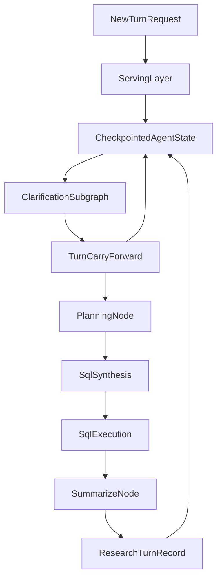

# Turn-Level Carry-Forward And Research Bundle

## Goal
Implement structured cross-turn memory for continuous conversations, especially after deep-research turns that produce multiple SQL queries, tables, and insights. Preserve the current checkpoint-based thread continuity while adding a durable, machine-usable bundle that downstream nodes can selectively consume, with explicit support for prior-SQL reuse in later synthesis turns.

## Current Anchors
- Serving and checkpoint/resume already happen in [agent_app/agent_server/agent.py](agent_app/agent_server/agent.py). Fresh turns merge `RESET_STATE_TEMPLATE`; interrupt resumes use `Command(resume=...)`.
- Turn-scoped conversational continuity already exists via `current_turn` and `turn_history` in [agent_app/agent_server/multi_agent/core/state.py](agent_app/agent_server/multi_agent/core/state.py).
- Clarification already reads prior summarized context from `current_turn.context_summary` in [agent_app/agent_server/multi_agent/agents/clarification.py](agent_app/agent_server/multi_agent/agents/clarification.py).
- Planning already prefers distilled turn context over raw chat in [agent_app/agent_server/multi_agent/agents/planning.py](agent_app/agent_server/multi_agent/agents/planning.py).
- Multi-query SQL/results/summary artifacts already exist in [agent_app/agent_server/multi_agent/agents/sql_synthesis.py](agent_app/agent_server/multi_agent/agents/sql_execution.py) and [agent_app/agent_server/multi_agent/agents/summarize.py](agent_app/agent_server/multi_agent/agents/summarize.py).

## Proposed Architecture
Add two new persistent state structures in [agent_app/agent_server/multi_agent/core/state.py](agent_app/agent_server/multi_agent/core/state.py):
- `turn_carry_forward`: compact structured context for the next turn.
- `research_history`: append-only snapshots of completed research turns.

Suggested shapes:
- `TurnCarryForward`
  - topic and relationship: `topic_id`, `parent_turn_id`, `intent_type`
  - user request digest: `raw_query`, `context_summary`
  - resolved slots: metric, dimensions, filters, timeframe, cohort, grain
  - retrieval hints: relevant spaces, route hint, join strategy hint
  - sql reuse hints: selected prior sql ids, inherited filters, inherited dimensions, inherited metrics, reusable joins/ctes, reuse mode
  - execution breadcrumbs: important labels, codes/entities, row-grain hints
  - clarification status
- `ResearchTurnRecord`
  - `turn_id`, `query`, `context_summary`, `final_summary_digest`
  - `plan_digest`
  - `sql_artifacts[]`: label, route, explanation, `reuse_metadata`, and full `sql`
  - `result_artifacts[]`: label, columns, row_count, row_grain_hint, preview/sample, status
  - `findings[]`: distilled insights with supporting artifact ids

Recommended `sql_artifacts[].reuse_metadata` shape:
- `filters`
- `time_filters`
- `group_by`
- `aggregates`
- `joins`
- `cte_blocks`
- `selected_columns`
- `order_by`
- `limit`
- `grain`
- `query_intent`

Keep both structures out of `get_reset_state_template()` so they persist across turns.

## Data Flow

## Implementation Steps

### 1. Extend durable state schema
Update [agent_app/agent_server/multi_agent/core/state.py](agent_app/agent_server/multi_agent/core/state.py):
- Add typed structures for `TurnCarryForward`, `ResearchTurnRecord`, and small nested artifact/finding records.
- Add persistent `AgentState` fields:
  - `turn_carry_forward: Optional[...]`
  - `research_history: Annotated[List[...], operator.add]`
- Do not include them in `RESET_STATE_TEMPLATE`.
- If any new list fields need merge semantics, use explicit reducers and avoid parallel write ambiguity.

### 2. Keep serving-layer semantics unchanged
Review [agent_app/agent_server/agent.py](agent_app/agent_server/agent.py) and the mirror path in [agent_app/agent_server/multi_agent/core/responses_agent.py](agent_app/agent_server/multi_agent/core/responses_agent.py):
- Leave fresh-turn per-query resets intact.
- Ensure no new persistent fields are accidentally injected into `RESET_STATE_TEMPLATE` paths.
- Keep interrupt/resume logic unchanged so clarification answers still resume entirely from checkpointed state.

### 3. Build carry-forward in clarification
Update [agent_app/agent_server/multi_agent/agents/clarification.py](agent_app/agent_server/multi_agent/agents/clarification.py):
- When `_check_clarity()` creates `current_turn`, also create an initial `turn_carry_forward` using:
  - current query
  - prior `current_turn` / `turn_history`
  - clarification metadata
  - basic inherited topic linkage
- Keep `context_summary` as the human-readable digest, but start storing structured fields alongside it.
- For clarification resumes, ensure the resulting carry-forward reflects the clarified scope rather than just concatenated prose.

### 4. Teach planning to consume structured prior-turn context
Update [agent_app/agent_server/multi_agent/agents/planning.py](agent_app/agent_server/multi_agent/agents/planning.py) and [agent_app/agent_server/multi_agent/agents/planning_agent.py](agent_app/agent_server/multi_agent/agents/planning_agent.py):
- Extend `extract_planning_context()` to include `turn_carry_forward` and the most relevant prior research record.
- Prefer structured inherited filters/timeframes/cohorts/spaces when the turn is a refinement or follow-up.
- Continue using vector-search reuse, but gate it with explicit carry-forward hints instead of only `parent_turn_id`.
- Update the planning prompt so it can choose among:
  - same analysis with modified filter
  - drill into one previous artifact
  - compare with prior result set
  - extend or adapt a previous SQL pattern
  - new topic
- Produce explicit SQL-reuse directives in the plan, such as:
  - selected prior SQL artifact ids
  - carry-forward filters/dimensions/metrics
  - whether to copy structure vs only inherit business constraints

### 5. Keep SQL synthesis plan-first, with selective artifact reuse
Update [agent_app/agent_server/multi_agent/agents/sql_synthesis.py](agent_app/agent_server/multi_agent/agents/sql_synthesis.py) and, if needed, [agent_app/agent_server/multi_agent/agents/sql_synthesis_agents.py](agent_app/agent_server/multi_agent/agents/sql_synthesis_agents.py):
- Do not pass full previous summaries/stories into synthesis.
- Use metadata-first SQL reuse:
  - always pass normalized `reuse_metadata` for selected prior SQL artifacts
  - pass full prior SQL only for the specific artifact(s) that planning selected for adaptation or exact-logic inspection
- Extend context extraction so synthesis can receive only selected reusable items from the plan/carry-forward:
  - inherited filters/timeframe
  - inherited dimensions and metrics
  - prior SQL labels or specific SQL text when user asks for extension/comparison
  - extracted join patterns / reusable CTE fragments when appropriate
  - artifact ids / row-grain hints
- Add an explicit synthesis rule: when a follow-up clearly means “same analysis but modified,” prefer adapting a selected previous SQL artifact over regenerating from scratch.
- Normalize previous SQL artifacts into reusable components before prompting synthesis so the agent can reuse:
  - WHERE predicates
  - GROUP BY dimensions
  - aggregate metrics
  - JOIN paths
  - reusable CTE skeletons
- Limit full-SQL inclusion to the top 1-2 selected artifacts to control prompt size and reduce accidental copying of irrelevant clauses.
- Ensure synthesis remains compatible with retry/sequential loop prompts.

### 6. Snapshot research output at summarize
Update [agent_app/agent_server/multi_agent/agents/summarize.py](agent_app/agent_server/multi_agent/agents/summarize.py):
- After building artifact entries and final summary, create a `ResearchTurnRecord` for the completed turn.
- Persist:
  - SQL queries + labels + explanations
  - normalized SQL reuse metadata per query
  - full SQL per artifact as an on-demand source of truth
  - execution result metadata and previews
  - plan digest and route info
  - compact insight digest derived from the final summary
- Return both `turn_carry_forward` and `research_history` updates in the node output.
- Optionally cap stored previews/hashes to avoid oversized checkpoints and traces.

### 7. Improve trace safety for larger persistent state
Review [agent_app/agent_server/multi_agent/core/graph.py](agent_app/agent_server/multi_agent/core/graph.py):
- Trim or summarize large `research_history` / preview payloads in `_trace_state_snapshot()` so MLflow traces do not balloon with large result payloads.
- Preserve key metadata such as `turn_id`, `parent_turn_id`, route, artifact counts.

### 8. Tighten summarize/message consistency for multi-query turns
While touching the research bundle path, fix the current asymmetry where durable artifacts represent multi-query runs but some message outputs still center the first result. Concentrate on [agent_app/agent_server/multi_agent/agents/summarize.py](agent_app/agent_server/multi_agent/agents/summarize.py) and the final event handling path in [agent_app/agent_server/agent.py](agent_app/agent_server/agent.py) so multi-query research turns produce a coherent durable bundle and final assistant message.

## Suggested Rollout Order
1. State schema and reducers.
2. Summarize-node research snapshot writer.
3. Clarification carry-forward writer.
4. Planning consumer.
5. SQL artifact normalization and synthesis consumer for prior-SQL reuse.
6. Trace-size hardening.

## Key Risks To Guard Against
- Accidentally placing persistent memory fields inside `RESET_STATE_TEMPLATE`, which would erase them every new turn.
- Introducing new parallel-branch write conflicts in clarification without reducers/single-writer discipline.
- Storing too much raw result data in checkpoints or traces.
- Re-feeding full deep-research prose into synthesis, causing prompt bloat and lower reliability.
- Blindly copying previous SQL when the business intent changed enough that only some filters/metrics should be inherited.
- Passing too many full prior SQL texts into synthesis, which can cause prompt bloat and make the model anchor on the wrong prior query.
- Breaking interrupt/resume semantics by depending on fresh-turn `initial_state` for carry-forward data.

## Verification Plan
- New topic after a prior research turn: ensure memory persists but does not contaminate planning.
- Follow-up refinement: “same analysis, Medicare only” reuses prior scope and artifacts correctly.
- SQL-pattern reuse: “same analysis, but group by payer instead of age band” preserves prior filters/metrics and only swaps the requested dimension.
- SQL-pattern reuse: “same query, but last 90 days instead of last year” preserves joins/metrics/dimensions and updates the time predicate only.
- Complex SQL reuse: a prior query with nontrivial CTE/window logic can be adapted correctly because synthesis receives the selected artifact's full SQL in addition to its normalized metadata.
- Drill-down: “show SQL behind the second table” resolves to the correct stored artifact.
- Comparison turn: “compare this with the previous result” loads the prior research bundle and plans explicit compare subquestions.
- Clarification interrupt/resume still works with persistent carry-forward present.
- Large multi-query research turn does not create oversized traces or duplicated state.
