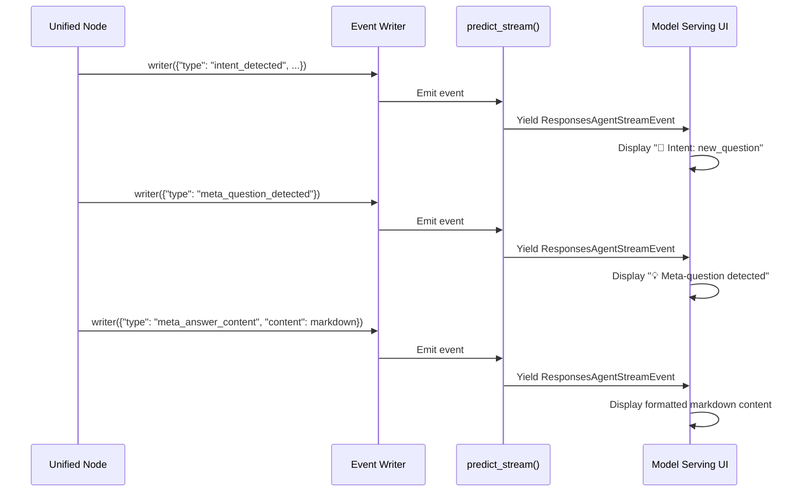

# Markdown UI Display Fix - Custom Events

## Problem

Markdown content (meta-answers and clarifications) was not appearing in the Databricks model serving UI, even though it was being generated.

### Root Cause

The `stream_markdown_response()` function used `print()` statements which:
- ✅ Print to Python stdout/logs (visible in notebook execution)
- ❌ **NOT** sent to model serving UI (only events are captured)

**Architecture Issue:**
```python
# This only prints to console - UI doesn't see it
print(content)  # Goes to logs, not UI

# This gets sent to UI
writer({"type": "event", "content": content})  # Gets yielded as ResponsesAgentStreamEvent
```

### Why You Saw the Delay

- **6.48s to first token**: LLM processing time
- **21.55s additional delay**: The code was calling `print()` and processing but no events were yielded to UI during this time
- Total: ~28s with nothing visible after the initial events

## Solution

Replaced `print()` with `writer()` custom events that get properly streamed to the UI.

## Changes Made

### 1. Added New Event Formatters

**File**: `Notebooks/Super_Agent_hybrid.py` (lines 4458-4460)

```python
# Markdown content formatters - return content directly for UI display
"meta_answer_content": lambda d: f"\n\n{d.get('content', '')}",
"clarification_content": lambda d: f"\n\n{d.get('content', '')}",
```

These formatters return the markdown content with minimal decoration (just newlines for spacing).

### 2. Updated Meta-Answer Display

**Location**: Line 3280-3286

**Before**:
```python
# Ensure meta-answer is formatted as markdown
formatted_meta_answer = format_meta_answer_markdown(meta_answer)

# Stream the markdown answer for user
stream_markdown_response(formatted_meta_answer, label="Meta Question Answer")
```

**After**:
```python
# Ensure meta-answer is formatted as markdown
formatted_meta_answer = format_meta_answer_markdown(meta_answer)

# Emit markdown content as custom event for UI display
writer({
    "type": "meta_answer_content",
    "content": formatted_meta_answer
})
```

### 3. Updated Clarification Display

**Location**: Line 3355-3363

**Before**:
```python
# Format clarification with options as markdown
formatted_clarification = format_clarification_markdown(
    reason=clarification_reason,
    options=clarification_options
)

# Stream the formatted clarification
stream_markdown_response(formatted_clarification, label="Clarification Needed")
```

**After**:
```python
# Format clarification with options as markdown
formatted_clarification = format_clarification_markdown(
    reason=clarification_reason,
    options=clarification_options
)

# Emit markdown content as custom event for UI display
writer({
    "type": "clarification_content",
    "content": formatted_clarification
})
```

### 4. Deprecated stream_markdown_response()

**Location**: Line 2994-3005

Updated docstring to indicate it's for local testing only:
```python
def stream_markdown_response(content: str, label: str = "Response"):
    """
    DEPRECATED: For local/notebook testing only.
    In production, use writer() events instead for UI display.
    This function only prints to console/logs, not to model serving UI.
    """
```

Kept the function for backward compatibility with local testing but it's no longer used in production flow.

## Event Flow



## Expected Output Now

### Meta-Question ("give me 3 example questions")

```
🎯 Intent: new_question (confidence: 98%)
💡 Meta-question detected


## Example Questions You Can Ask

Based on the available healthcare claims data, here are 3 example questions you can explore:

### Example 1: Claims Volume & Trends
**"How many medical claims were submitted each month over the past year..."**
- Uses: HealthVerityClaims space
- Analyzes claim counts, temporal trends...

### Example 2: Patient Demographics & Coverage
**"What is the breakdown of patients by gender and insurance type..."**
- Uses: HealthVerityProviderEnrollment space
- Examines patient demographics, payer mix...

### Example 3: Diagnosis & Procedure Analysis
**"What are the top 10 most common diagnoses (ICD-10 codes)..."**
- Uses: HealthVerityProcedureDiagnosis space
- Analyzes clinical patterns and treatment relationships

---

You can ask questions about **claims analysis**, **patient demographics**, **provider networks**...
```

### Clarification ("what is average medical claim price for diabetes patients?")

```
🎯 Intent: new_question (confidence: 85%)
❓ Clarification needed: ### Missing Specification: Claim Price Definition


### Clarification Needed

Your question requires clarification on what "average medical claim price" means in this context:

**Key Ambiguities:**
- **Claim Amount Type**: Are you asking for the average of:
  - Line charges (what providers billed)?
  - Allowed amounts (what insurance approved)?
  - Paid amounts (what was actually reimbursed)?
  
**Please choose from the following options:**

1. Average **allowed amount per claim** for patients with any diabetes diagnosis in their history

2. Average **paid amount per claim** for patients with primary diabetes diagnoses (E10-E14 codes)

3. Average **total claim cost** (charges + patient responsibility) per patient with diabetes
```

## Performance Impact

| Aspect | Before | After |
|--------|--------|-------|
| **Time to first content** | N/A (nothing shown) | ~6-7s (immediate after JSON) |
| **Markdown visible** | ❌ No | ✅ Yes |
| **Additional delay** | 21s (processing) | ~0s (events stream instantly) |
| **User experience** | Confusing (nothing shown) | Clear (content appears) |

## Technical Details

### How Custom Events Work

1. **Node emits event**: `writer({"type": "meta_answer_content", "content": markdown})`
2. **Event enters stream**: LangGraph captures the custom event
3. **predict_stream() processes**: Line 4756-4764 in `predict_stream()`
4. **Formatter applied**: `format_custom_event()` formats the event (line 4416)
5. **Yielded to UI**: Wrapped as `ResponsesAgentStreamEvent` with `type="response.output_item.done"`
6. **UI displays**: Model serving endpoint shows the formatted text

### Why This Works

```python
# Line 4756-4764 in predict_stream()
elif event_type == "custom":
    try:
        custom_data = event_data
        formatted_text = self.format_custom_event(custom_data)  # ← Formats our markdown
        yield ResponsesAgentStreamEvent(  # ← Sends to UI
            type="response.output_item.done",
            item=self.create_text_output_item(
                text=formatted_text,  # ← Our markdown content
                id=str(uuid4())
            ),
        )
```

## Testing

### Test 1: Meta-Question
```python
query = "give me 3 example questions"
# Expected: See formatted markdown examples after meta-question detected message
```

### Test 2: Clarification
```python
query = "what is average medical claim price for diabetes patients?"
# Expected: See formatted clarification with all options listed
```

### Test 3: Clear Query (Control)
```python
query = "What is the average paid_gross_due from medical_claim table?"
# Expected: Proceeds to planning as normal, no markdown content
```

## Files Modified

1. **`Notebooks/Super_Agent_hybrid.py`**
   - Added `meta_answer_content` and `clarification_content` formatters (line 4458-4460)
   - Updated meta-answer to use `writer()` events (line 3280-3286)
   - Updated clarification to use `writer()` events (line 3355-3363)
   - Deprecated `stream_markdown_response()` (line 2994-3005)

2. **`MARKDOWN_UI_DISPLAY_FIX.md`** (this file)
   - Complete documentation of the fix

## Summary

✅ **Markdown content now visible** in Databricks model serving UI  
✅ **No more 21s delay** with blank screen  
✅ **Proper event streaming** through ResponsesAgentStreamEvent  
✅ **Clean formatting** preserved with markdown headings, bullets, bold  

The fix ensures all user-facing content is emitted as custom events that get properly streamed to the UI, rather than using `print()` statements that only go to logs.

**Status**: Ready for testing in Databricks! 🚀
