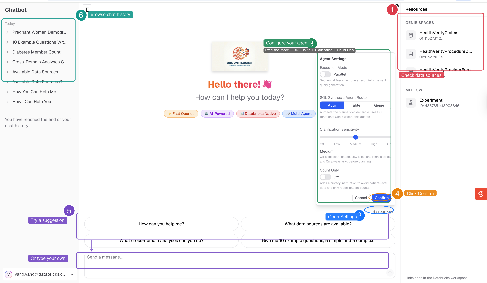

# DBX-UnifiedChat - Databricks Unified Chat

> A multi-agent system for intelligent cross-domain data queries built with LangGraph, Databricks Genie, Lakebase, and Claude models/skills on Databricks Platform.

[](https://www.python.org/downloads/)
[](LICENSE.md)
[](https://github.com/langchain-ai/langgraph)
[](https://github.com/langchain-ai/langchain)
[](https://mlflow.org/)
[](https://github.com/databricks/databricks-sdk-py)
[](https://github.com/pydantic/pydantic)
[](https://www.anthropic.com/claude)
[](https://www.anthropic.com/claude)

---

## Overview

Organizations struggle to query data across multiple domains and data sources, requiring deep SQL expertise and knowledge of complex data schemas. **Databricks Unified Chat** solves this by providing an intelligent multi-agent system that routes natural language queries to the appropriate data sources, synthesizes results, and delivers comprehensive answers.

Built on LangGraph, Databricks Genie and Lakebase, this solution enables business users to ask questions spanning multiple data domains without needing to understand the underlying data architecture or write complex SQL queries.

> ### Why use DBX-UnifiedChat?
- **Accuracy of Answer** 
    - Validated with customers and partners, e.g., tumor outcome data analysis.
- **Explanation and Curation** 
    - Results are curated and explained by SQL answer returned and associated explanations.
- **Speed**
    - Optimized with parallel/cache/token reduction/architecture design
    - Achieves 1-2 seconds TTFT
    - For complex query across domains, we see it achieves 1/3 to 1/2 of the time of the No/Low-Code custom agent solution.


## Architecture


The system uses a multi-agent architecture powered by LangGraph:

* **Supervisor Agent (multi-purpose)** - Frontend agent that orchestrates the workflow and coordinates handoffs to other agents
* **Thinking & Planning Agent** - Analyzes queries and creates execution plans based on the query intent and context
* **Genie Agents** - Query individual Genie spaces for domain-specific data
* **SQL Synthesis Agent (table route)** - Combines and synthesizes SQL across table data sources using UC Functions (instructed retrieval)
* **SQL Synthesis Agent (genie route)** - Combines and synthesizes SQL across genie space data sources using Genie agents as tools (parallel execution)
* **SQL Execution Agent** - Executes queries and extracts results
* **Summarize Agent** - Summarizes results and formats responses for the user

The system leverages:
* **LangGraph** for agent orchestration and workflow management
* **LangChain** for agent tools and integrations
* **Lakebase** for state management and long/short-term memory
* **Databricks Genie** as Agent/Tool for natural language to SQL conversion
* **UC Functions** as Tools for multi-step instructed retrieval
* **Databricks SDK** for Databricks platform integration
* **Databricks SQL Warehouse** for query execution
* **Model Serving** for model deployment and serving
* **MLflow** for Agent observability, evaluation and model tracking
* **Pydantic** for data validation and configuration
* **Pytest** for testing framework
* **PyYAML** for configuration management
* **Vector Search** for semantic metadata retrieval
* **Unity Catalog** for data governance and metadata management

### Key Technologies Applied:

* **Multi-turn Chatting** - Supports clarification, continue, refine, and new question flows for conversational interactions
* **Meta-question Fast Route** - Optimized path for handling meta-questions about the system itself
* **Multi-step Instructed Retrieval** - Advanced retrieval strategy in table route with step-by-step instructions
* **Parallel GenieAgent Tool Calls** - Concurrent execution of multiple Genie agents for improved performance in Genie route
* **Lakebase with Long/Short-term Memory** - Persistent memory management for maintaining context across conversations

See [Architecture Documentation](docs/ARCHITECTURE.md) for detailed design.


## Presentation

<a href="https://blitzbricksteryy-db.github.io/dbx-unifiedchat/docs/decks/slides_2slide.html" target="_blank">
  
  <br />
  <b>🚀 Click here to view the Interactive Presentation Slides</b>
</a>


## UI Illustration



---

## Quick Start

### Prerequisites

* Python 3.10 or higher
* Node.js 18 or higher
* `uv`, `npm`, `jq`, and Databricks CLI
* Databricks workspace with:
  * Genie spaces configured
  * SQL Warehouse configured
  * Permissions to deploy Databricks Asset Bundles and Databricks Apps

### Installation

```bash
git clone https://github.com/databricks-solutions/dbx-unifiedchat.git
cd dbx-unifiedchat
```

### Recommended Workflow

#### 1. Use the canonical app bundle in `agent_app`

The supported deployment surface is the Databricks App bundle under `agent_app/`.
It now owns:

* app deployment
* ETL preparation
* shared Lakebase / Unity Catalog bootstrap
* deployment validation

From a local terminal or CI runner:

```bash
cd agent_app
./scripts/deploy.sh --target dev --full-deploy --run
```

Useful variations:

* `./scripts/deploy.sh --target prod --full-deploy --run`
* `./scripts/deploy.sh --prep-only`
* `./scripts/deploy.sh --sync --full-deploy --run`
* `./scripts/deploy.sh --target prod --full-deploy --ci --skip-bootstrap`

The deploy script validates the bundle, deploys the app resources, runs the prep or
full deployment job graph, and can optionally start the app.

#### 2. Workspace-native operator flow

If you prefer to operate entirely inside Databricks, open
`agent_app/scripts/deploy_notebook.py` and use it as a guided handoff to the
Databricks web terminal. That notebook resolves the active target, prints the
exact `./scripts/deploy.sh ...` command to run, and provides post-deploy
verification.

#### 3. Local app development in `agent_app`

Use the bootstrap/build script once, then use hot reload for normal development.

```bash
cd agent_app

# One-time local bootstrap/build
./scripts/dev-local.sh

# Iterative development with hot reload
./scripts/dev-local-hot-reload.sh
```

Useful options:

* `./scripts/dev-local.sh --profile <profile>`
* `./scripts/dev-local-hot-reload.sh --profile <profile>`
* `./scripts/dev-local-hot-reload.sh --skip-migrate`

#### 4. Legacy Model Serving notebooks

The older Model Serving notebooks still exist as reference material, but they are
not the recommended deployment path for the application. Use `agent_app/` for
active deployments.

---

## Repository Structure

```text
.
├── etl/                            # Shared ETL notebooks synced by the app bundle
├── agent_app/                      # Canonical Databricks App + deployment bundle
│   ├── databricks.yml              # Canonical app DAB
│   ├── agent_server/               # Multi-agent backend
│   ├── e2e-chatbot-app-next/       # Frontend and app backend
│   ├── workflows/                  # App prep / validation notebook tasks
│   ├── scripts/
│   │   ├── deploy.sh               # Canonical local / CI deploy entrypoint
│   │   ├── dev-local.sh            # One-time local bootstrap/build
│   │   └── dev-local-hot-reload.sh # Local hot-reload workflow
│   ├── resources/                  # App resources + prep/full deployment jobs
│   └── tests/                      # App-specific unit tests
├── tests/                          # Root integration and end-to-end tests
├── docs/                           # Project documentation
└── notebooks/                      # Legacy / notebook-based workflows
```

---

## Documentation

### Getting Started

* [**Development Guide**](docs/DEVELOPMENT_GUIDE.md) - Project setup and workflow overview
* [**ETL Guide**](docs/ETL_GUIDE.md) - Metadata indexing workflow used by the app bundle
* [**Local Development Guide**](docs/LOCAL_DEVELOPMENT.md) - Local environment notes
* [**Configuration Reference**](docs/CONFIGURATION.md) - Configuration details across environments

### Reference

* [**Architecture**](docs/ARCHITECTURE.md) - System design and agent workflows
* [**API Reference**](docs/API.md) - Agent APIs and interfaces
* [**Testing Guide**](tests/README.md) - Run tests and write new tests
* [**Contributing**](CONTRIBUTING.md) - Contribution guidelines
* `agent_app/scripts/deploy.sh` - Canonical local and CI deployment entry point
* `agent_app/scripts/deploy_notebook.py` - Workspace-native operator handoff
* `agent_app/scripts/dev-local.sh` - Current local bootstrap/build entry point
* `agent_app/scripts/dev-local-hot-reload.sh` - Current hot-reload development entry point

---

## Testing

```bash
# Root integration / e2e tests
pytest tests/

# Agent app unit tests
pytest agent_app/tests/
```

See [Testing Guide](tests/README.md) for detailed testing documentation.

---

## Configuration

This repository now centers on one active deployment bundle plus local dev config:

| Configuration | Scope | Purpose |
|--------------|-------|---------|
| `agent_app/databricks.yml` | App bundle | Canonical Databricks App, ETL prep, and validation settings |
| `agent_app/.env` | Local app dev | Local script configuration for auth, database, and MLflow |

See [Configuration Guide](docs/CONFIGURATION.md) for more detail.

---

## Examples

### App Deployment

```bash
cd agent_app
./scripts/deploy.sh --full-deploy --run
```

### Local Development

```bash
cd agent_app
./scripts/dev-local.sh
./scripts/dev-local-hot-reload.sh
```

---

## What's Included

| Component | Description |
|-----------|-------------|
| **Multi-Agent System** | LangGraph-based agent orchestration with specialized agents |
| **Genie Integration** | Native integration with Databricks Genie spaces |
| **Vector Search** | Semantic routing and metadata retrieval |
| **ETL Pipeline** | Metadata export, enrichment, and vector index build driven from the app bundle |
| **Deployment Tools** | One canonical shell entrypoint plus a guided Databricks notebook handoff |
| **Test Suite** | Comprehensive unit, integration, and E2E tests |

---

## Contributing

We welcome contributions! Please see [CONTRIBUTING.md](CONTRIBUTING.md) for:

* Development setup and workflow
* Code style guidelines and testing requirements
* Pull request process
* Community guidelines

For security vulnerabilities, please see our [Security Policy](SECURITY.md).

---

## Support Disclaimer

The content provided here is for **reference and educational purposes only**. It is not officially supported by Databricks under any Service Level Agreements (SLAs). All materials are provided **AS IS**, without any guarantees or warranties, and are not intended for production use without proper review and testing.

The source code in this project is provided under the Databricks License. All third-party libraries included or referenced are subject to their respective licenses. See [NOTICE.md](NOTICE.md) for third-party license information.

If you encounter issues while using this content, please open a GitHub Issue in this repository. Issues will be reviewed as time permits, but there are **no formal SLAs** for support.

---

## License

(c) 2026 Databricks, Inc. All rights reserved.

The source in this project is provided subject to the Databricks License. See [LICENSE.md](LICENSE.md) for details.

**Third-Party Licenses**: This project depends on various third-party packages. See [NOTICE.md](NOTICE.md) for complete attribution and license information.

---

## Acknowledgments

Built with:

* [**LangGraph**](https://github.com/langchain-ai/langgraph) - Agent orchestration and workflow management
* [**Databricks Genie**](https://docs.databricks.com/genie/) - Natural language to SQL conversion
* [**Databricks Vector Search**](https://docs.databricks.com/vector-search/) - Semantic search and retrieval
* [**MLflow**](https://mlflow.org/) - Model deployment and serving
* [**Unity Catalog**](https://docs.databricks.com/data-governance/unity-catalog/) - Data governance and metadata

---

## About Databricks Field Solutions

This repository is part of the [Databricks Field Solutions](https://github.com/databricks-solutions) collection - a curated set of real-world implementations, demonstrations, and technical content created by Databricks field engineers to share practical expertise and best practices.
