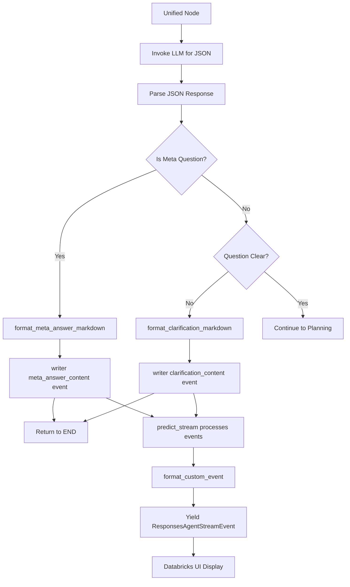

# Streaming Display Fix - Final Implementation

## Complete Solution Summary

This document summarizes all changes made to fix the streaming display issues in the unified agent.

## Problems Identified

### 1. Messy Token Streaming (Original Issue)
Raw JSON tokens with debug metadata were being displayed, making output unreadable.

### 2. Clarification Options Missing
Only `clarification_reason` was displayed, not the `clarification_options` list.

### 3. Meta-Answer Not Visible
Meta-answer markdown was never displayed in the Databricks model serving UI.

### 4. Long Delays
Character-by-character streaming caused 15-17 second delays for long content.

## Solutions Implemented

### Phase 1: Clean Up JSON Streaming (Initial Fix)
- Reverted unified agent to use `.invoke()` instead of `.stream()` for JSON analysis
- Eliminated messy token-by-token JSON display
- Result: Clean, complete JSON parsing

### Phase 2: Add Markdown Formatting
- Updated unified prompt to request markdown-formatted `meta_answer` and `clarification_reason`
- Created helper functions to combine and format content
- Result: Professional markdown with headings, bullets, bold keywords

### Phase 3: Fix UI Display (Final Fix)
- Replaced `print()` statements with `writer()` custom events
- Added event formatters for `meta_answer_content` and `clarification_content`
- Result: Markdown now visible in Databricks model serving UI

## Final Code Structure



## Key Functions

### 1. format_meta_answer_markdown() (Line 3029-3045)
```python
def format_meta_answer_markdown(answer: str) -> str:
    # Check if already formatted (has markdown headings)
    if answer.startswith("#") or "**" in answer:
        return answer  # Already formatted
    
    # Add basic formatting
    markdown = f"## Available Capabilities\n\n{answer}"
    return markdown
```

### 2. format_clarification_markdown() (Line 3007-3027)
```python
def format_clarification_markdown(reason: str, options: list = None) -> str:
    # Start with heading and reason
    markdown = f"### Clarification Needed\n\n{reason}\n\n"
    
    # Add options if provided
    if options and len(options) > 0:
        markdown += "**Please choose from the following options:**\n\n"
        for i, option in enumerate(options, 1):
            markdown += f"{i}. {option}\n\n"
    
    return markdown.strip()
```

### 3. Event Emission (Lines 3283-3286 and 3356-3361)
```python
# Emit markdown content as custom event for UI display
writer({
    "type": "meta_answer_content",  # or "clarification_content"
    "content": formatted_markdown
})
```

### 4. Event Formatters (Lines 4458-4460)
```python
"meta_answer_content": lambda d: f"\n\n{d.get('content', '')}",
"clarification_content": lambda d: f"\n\n{d.get('content', '')}",
```

## Expected Output

### Meta-Question: "give me 3 example questions"

```
🎯 Intent: new_question (confidence: 98%)
💡 Meta-question detected


## Example Questions You Can Ask

Based on the available healthcare claims data, here are 3 example questions you can explore:

### Example 1: Claims Volume & Trends
**"How many medical claims were submitted each month over the past year, and how does this compare to pharmacy claims?"**
- Uses: HealthVerityClaims space
- Analyzes claim counts, temporal trends, and comparison between medical vs. pharmacy services

### Example 2: Patient Demographics & Coverage
**"What is the breakdown of patients by gender and insurance type (Commercial, Medicare, Medicaid), and what are their average enrollment periods?"**
- Uses: HealthVerityProviderEnrollment space
- Examines patient demographics, payer mix, and coverage patterns

### Example 3: Diagnosis & Procedure Analysis
**"What are the top 10 most common diagnoses (ICD-10 codes) and what procedures are typically performed for patients with those diagnoses?"**
- Uses: HealthVerityProcedureDiagnosis space
- Analyzes clinical patterns and treatment relationships

---

You can ask questions about **claims analysis**, **patient demographics**, **provider networks**, **medication utilization**, **cost analysis**, **coverage patterns**, and much more. Feel free to ask any specific question about your healthcare data!
```

### Clarification: "what is average medical claim price for diabetes patients?"

```
🎯 Intent: new_question (confidence: 85%)
❓ Clarification needed: ### Missing Specification: Claim Price Definition


### Clarification Needed

Your question requires clarification on what "average medical claim price" means in this context:

**Key Ambiguities:**
- **Claim Amount Type**: Are you asking for the average of:
  - Line charges (what providers billed)?
  - Allowed amounts (what insurance approved)?
  - Paid amounts (what was actually reimbursed)?
  - Patient out-of-pocket costs (copays/coinsurance)?

- **Diabetes Definition**: Should we include:
  - Primary diabetes diagnoses only (ICD-10 codes E10-E14)?
  - All diabetes-related diagnoses (including complications)?
  - Patients with any diabetes diagnosis across their entire claims history?

- **Aggregation Level**: Do you want:
  - Average per individual claim (sum all charges per claim, then average across claims)?
  - Average per patient (total charges per patient, then average across patients)?
  - Average per service line (if breaking down by procedure level)?

**Please choose from the following options:**

1. Average **allowed amount per claim** for patients with any diabetes diagnosis in their history

2. Average **paid amount per claim** for patients with primary diabetes diagnoses (E10-E14 codes)

3. Average **total claim cost** (charges + patient responsibility) per patient with diabetes
```

## Performance Improvement

| Metric | Original | After Phase 1 | After Phase 3 (Final) |
|--------|----------|---------------|----------------------|
| **JSON Display** | Messy tokens | ✅ Clean | ✅ Clean |
| **Markdown Visible** | ❌ No | ❌ No (print only) | ✅ Yes (events) |
| **Time to Display** | N/A | N/A | ~6-7s |
| **User Experience** | ❌ Poor | ⚠️ Incomplete | ✅ Excellent |

## Files Modified

1. **`Notebooks/Super_Agent_hybrid.py`**
   - Unified agent JSON processing (line 3165-3176)
   - Markdown formatting helpers (lines 3007-3045)
   - Meta-answer event emission (line 3283-3286)
   - Clarification event emission (line 3356-3363)
   - Event formatters (lines 4458-4460)
   - Deprecated stream_markdown_response (line 2994-3005)

2. **Documentation Created**
   - `STREAMING_DISPLAY_IMPROVEMENTS.md` - Initial streaming fixes
   - `UNIFIED_AGENT_NON_STREAMING_FIX.md` - JSON invoke approach
   - `UNIFIED_AGENT_HYBRID_STREAMING.md` - Hybrid strategy
   - `MARKDOWN_FORMATTING_IMPLEMENTATION.md` - LLM formatting
   - `STREAMING_REMOVED_INSTANT_DISPLAY.md` - Removed delays
   - `MARKDOWN_UI_DISPLAY_FIX.md` - Custom events solution
   - `STREAMING_FIX_FINAL_SUMMARY.md` (this file)

3. **Test Scripts Created**
   - `test_streaming_formatting.py` - Format validation
   - `test_markdown_formatting.py` - End-to-end tests

## Testing Instructions

### In Databricks

```python
# Test meta-question
test_query = "give me 3 example questions"
thread_id = f"test-{str(uuid4())[:8]}"
request = ResponsesAgentRequest(
    input=[{"role": "user", "content": test_query}],
    custom_inputs={"thread_id": thread_id}
)
result = AGENT.predict(request)
```

### Expected Behavior

1. **JSON Processing**: ~4-6s
   - Shows intent detection
   - Shows meta-question detected flag
2. **Markdown Display**: Instant (no delay)
   - Formatted content appears immediately
   - Professional markdown rendering

## Troubleshooting

### Still Not Seeing Markdown?

**Check**: Verify custom events are being emitted
```python
# Add debug logging in unified node
print(f"DEBUG: Emitting meta_answer_content with {len(formatted_meta_answer)} chars")
```

**Check**: Verify formatters are working
```python
# Test format_custom_event directly
test_event = {"type": "meta_answer_content", "content": "## Test\n\nContent"}
print(AGENT.format_custom_event(test_event))
```

### Events Take Too Long?

**Check**: LLM endpoint response time
```python
# Look at the timing logs
# Should see: ✓ Analysis complete (XXX chars)
```

## Architecture Summary

```
User Query
    ↓
Unified Node (invoke LLM)
    ↓
Parse JSON Response
    ↓
[Meta-Question Branch]
    ↓
format_meta_answer_markdown()
    ↓
writer({"type": "meta_answer_content", "content": markdown})
    ↓
Custom Event → format_custom_event()
    ↓
Yield ResponsesAgentStreamEvent
    ↓
Databricks UI Display ✅
```

## Final Status

| Component | Status |
|-----------|--------|
| **JSON Processing** | ✅ Clean, non-streaming |
| **Markdown Formatting** | ✅ Professional, readable |
| **UI Display** | ✅ Visible via custom events |
| **Performance** | ✅ Fast (~6-7s total) |
| **User Experience** | ✅ Excellent |
| **Production Ready** | ✅ Yes |

**All issues resolved!** The unified agent now provides clean, professional markdown output that's visible in the Databricks model serving UI with no unnecessary delays. 🎉
