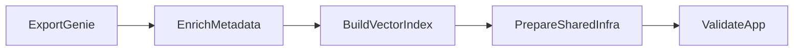

# Deployment Guide

This repository now has one supported deployment surface for the application:

- bundle root: `agent_app/`
- canonical entrypoint: `agent_app/scripts/deploy.sh`
- guided workspace/operator path: `agent_app/scripts/deploy_notebook.py`

## Canonical Flow

Run deployments from `agent_app/`:

```bash
cd agent_app
./scripts/deploy.sh --target dev --full-deploy --run
```

What this does:

1. validates the app bundle
2. deploys the Databricks App resources
3. runs the shared prep or full-deploy job graph
4. optionally starts the app
5. smoke-checks the deployed app surface

## Deployment Modes

| Mode | Command | When to use it |
|------|---------|----------------|
| Deploy only | `./scripts/deploy.sh --target dev` | Update bundle-managed resources without running prep jobs |
| Prep only | `./scripts/deploy.sh --target dev --prep-only` | Build metadata and bootstrap shared infra before app rollout |
| Full deploy | `./scripts/deploy.sh --target dev --full-deploy` | Run prep plus deployment validation |
| Full deploy + start | `./scripts/deploy.sh --target dev --full-deploy --run` | Standard end-to-end operator flow |
| CI mode | `./scripts/deploy.sh --target prod --full-deploy --run --ci --skip-bootstrap` | Non-interactive runner with preinstalled tooling |

## What The Job Graph Runs

The `agent_app` bundle now owns the deployment execution graph:



Notes:

- `databricks bundle deploy` still provisions the Databricks App resources.
- The prep and full-deploy jobs handle metadata preparation and validation around that deploy.
- `--run` starts the app resource after those stages complete.

## Workspace-Native Operator Path

If you want a Databricks-native flow:

1. Open `agent_app/scripts/deploy_notebook.py` in Databricks.
2. Set `project_dir`, `target`, `deploy_mode`, `sync_first`, and `run_after`.
3. Run the preflight cell.
4. Copy the printed `./scripts/deploy.sh ...` command into the Databricks web terminal.
5. Re-run the verification cell after the terminal command completes.

This path is meant to be the easiest operator experience inside Databricks while
still using the same underlying deploy contract as local terminals and CI.

## Prerequisites

For local terminal deploys:

- Databricks CLI with bundle support
- Databricks auth via `--profile` or ambient credentials
- Python 3.11+
- `uv` if you want the script to bootstrap local Python dependencies

For CI:

- modern Databricks CLI installed via `databricks/setup-cli`
- workspace auth in environment variables
- runner access to execute `agent_app/scripts/deploy.sh`

## CI/CD

GitHub Actions should deploy from the same place humans do:

- validate: `cd agent_app && databricks bundle validate -t dev`
- deploy dev: `./scripts/deploy.sh --target dev --full-deploy --run --ci --skip-bootstrap`
- deploy prod: `./scripts/deploy.sh --target prod --full-deploy --run --ci --skip-bootstrap`

## Troubleshooting

### Bundle validation fails

- Run `cd agent_app && databricks bundle validate -t <target>`.
- Confirm the target profile or ambient auth points at the intended workspace.
- Check that ETL paths are available through `sync.paths`.

### Prep job fails

- Re-run with `--prep-only` to isolate ETL and shared infra issues.
- Check the Databricks job run output for the failing task.
- Confirm Genie space IDs, SQL warehouse, UC schema, and Lakebase instance are correct for the target.

### App deploy succeeds but app is unusable

- Re-run with `--full-deploy --run` so prep, validation, and startup all happen in order.
- Use `databricks apps get <app-name>` and `databricks apps logs <app-name>` to inspect runtime state.
- Check that the app service principal has the expected schema, volume, warehouse, and Lakebase access.

### Notebook operator flow is confusing

- Use `deploy_mode=full-deploy` unless you intentionally want a narrower step.
- Keep `project_dir` pointed at `agent_app`.
- Treat the notebook as a control plane only; run the printed deploy command in the web terminal.

## Legacy Notes

The older Model Serving deployment materials remain as historical reference only.
They are not part of the supported app deployment path.
